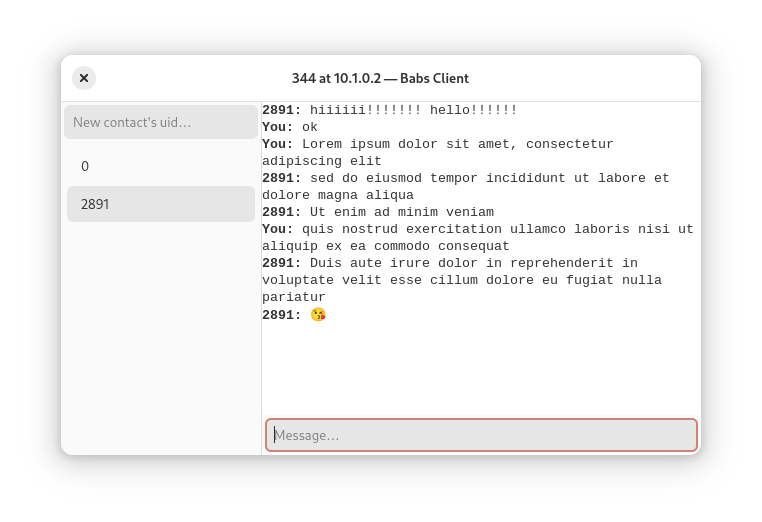

<p align="center">
   
</p>

A simple instant messaging app.
* Client-server
* Written in C++ using Boost libraries
* Asynchronous server and client apps
* Graphical client app using Gtk4 and libadwaita
* Documentation using Doxygen



## Compiling
Required: meson, g++, Boost, gtkmm 4.
```
git clone https://github.com/furtarball/babs
cd babs
meson setup builddir
meson compile -C builddir
```
`client` must be in the same directory as `babs.ui` from `src/client`.

## Usage
Server requires open port 52137. Client takes two command line arguments: server's IP and user ID.

Use top left text field to add a new contact by UID. A new conversation will appear in the sidebar. Use bottom text input to send messages.

## Protocol spec
Version 0
1. Client establishes a TCP connection
2. Server accepts and immediately sends a hello message
3. Client sends a login request
4. Server responds with state
5. Server awaits further requests

### Request/response spec
* header (1)
* preamble (2, 3)
* content (4)

1. length: 4 bytes unsigned
2. version: 2 bytes unsigned
3. type: 2 bytes unsigned
   * 0 none (to send such a packet is an error)
   * 1 hello
   * 2 state
   * 3 login
   * 4 message
5. content…
   * hello: name (string)
   * state: 1 byte unsigned: 0 ok, 1… error
   * login: uid
   * message: sender's uid, recipient's uid, content (string)

uid: 2 bytes unsigned

all strings are utf-8

## Acknowledgements
Banner background photo: [Phoenicopteridae Phoenicopterus ruber AMERICAN FLAMINGO, NasserHalaweh, Wikimedia Commons](https://commons.wikimedia.org/wiki/File:Phoenicopteridae_Phoenicopterus_ruber_4.1.jpg), CC BY-SA 4.0

Banner font: Mrs Sheppards, Sudtipos, OFL
